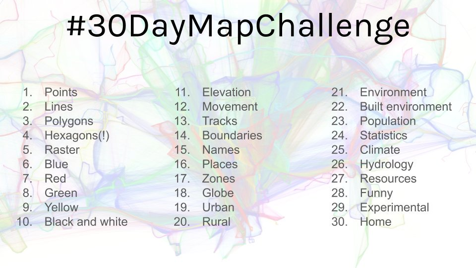

In the end of October 2019 Topi Tjukanov announced the 30 Day Map Challenge in Twitter. So, anyone taking the challenge should make one map per day in whole November following the themes provided. There were no restrictions for the tools. As I've already wanted to try out some cool new mapping stuff for quite some time and I also to test the capabilities of QGIS vs ArcGIS then I decided to accept the challenge.

[Link to Topi's Twitter post](https://twitter.com/tjukanov/status/1187713840550744066)
