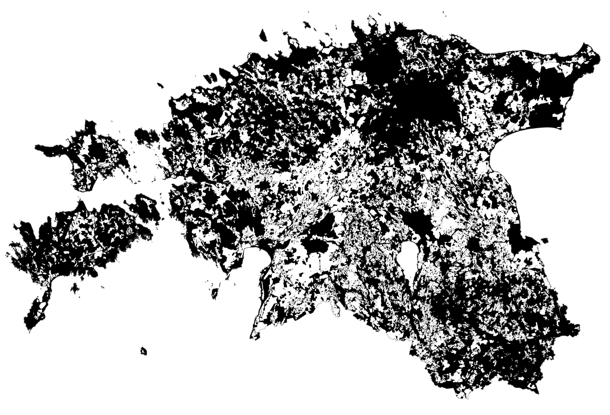

The tenth daya - BLACK AND WHITE. Some things are beautiful in their simplicity. The drainage is mapped as white on the map. Quite surprising, how "wet" Estonia is and that most of our land is drained. The data is from [Estonian Land Board, restrictions database](https://geoportaal.maaamet.ee/est/Ruumiandmed/Kitsenduste-andmed-p32.html).

[Link to original Twitter post](https://twitter.com/evelynuuemaa/status/1193447281191768065)
