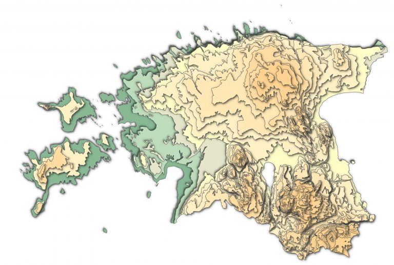

The 11th day - ELEVATION. Paper cut map style - one of the styles I've wanted to try since I first saw it. I believe, the original style is actually from [ESRI](https://esri-styles.maps.arcgis.com/home/item.html?id=6c01b3d015ce40eca7846941d6313fe8) but you can easily create it also in QGIS by using Draw Effects. Draw Effects is an awesome feature for styling  in QGIS. This little button under Symbology makes the use of Adobe unnecessary for after-effects. Draw Effects allows you to create shaddow and glow effects and has several different blending modes. Here is a quick [video](https://www.youtube.com/watch?v=t2gAUlM5Lvc) to get you started with Draw Effects.  The most complicated part was actually to get elevation data as polygons. I tried to generalise myself but eventually gave up because of lack of time. I found elevation data as polygons from an old Estonian Geograhy CD database and used this. 

[Link to original Twitter post](https://twitter.com/evelynuuemaa/status/1193888748162953217)
