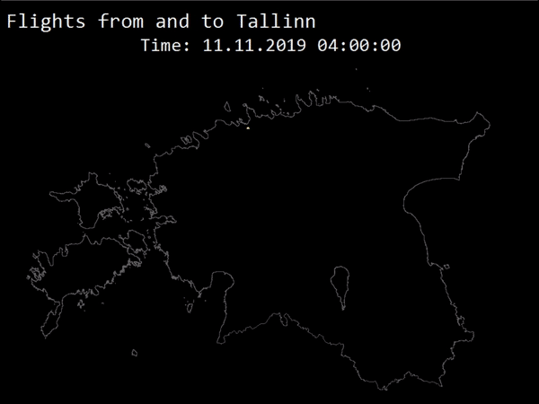

The 12th day - MOVEMENT. THere is not much open data about movement in Estonia. Therefore, I downloaded 1 day data from [Flightradar](https://www.flightradar24.com/) but there is also a limit how much you can download per day wchich makes the process quite painful. I converted the flight track points into line segments and visualised. The color shows the height of the plane.

[Link to original Twitter post](https://twitter.com/evelynuuemaa/status/1194356376534958080)
