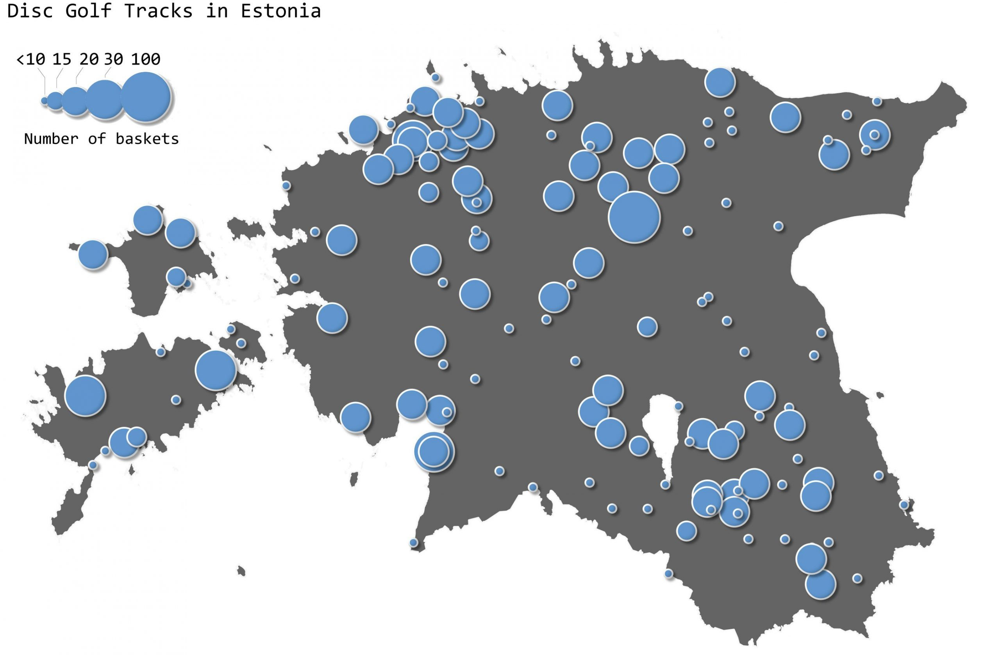

THe 13th day - TRACKS. Again not easy to find open data about tracks. I stumbled over a page [discgolfirajad.ee](https://www.discgolfirajad.ee/) which has collected all the discgolf tracks in Estonia and each tracks has also the information about how many baskets are on the track. It is always nice to visualise some additional information in addition to location. Therefore, I visualised the location of discgolf tracks by the number of baskets on tracks. I used Draw Effects to style the points.

[Link to original Twitter post](https://twitter.com/evelynuuemaa/status/1194626426655272964)
