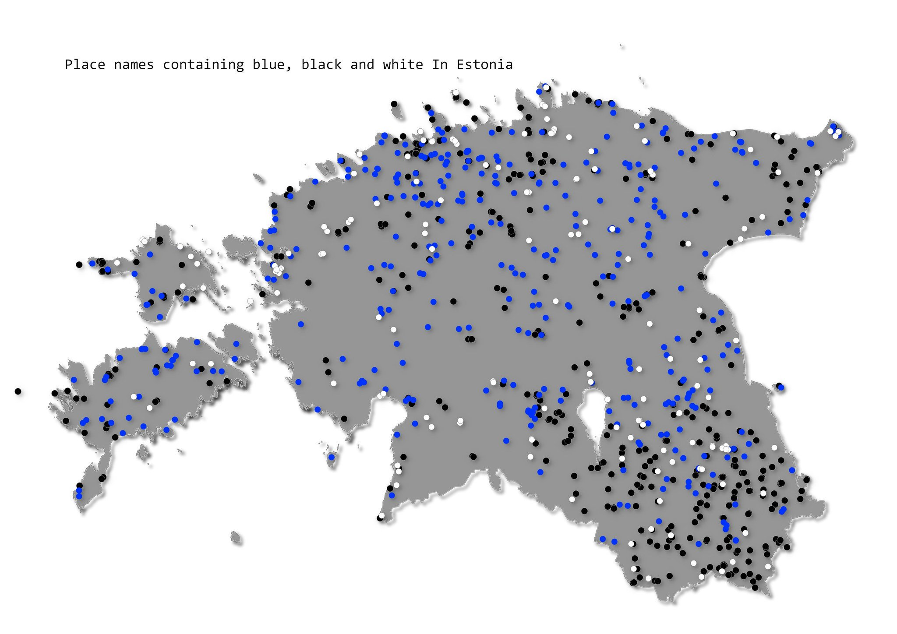

The 15th da - PLACES. A simple idea to visualise place names in Estonia that contain words "sini", "must", and "valge" (blue, black, white - Estonian flag colors). I queried and downloaded the data from [Estonian Land Board Place Name Registry (Kohanimeregister)](https://www.maaamet.ee/et/eesmargid-tegevused/kohanimeregister) and visualised with the respective colors.

[Link to original Twitter post](https://twitter.com/evelynuuemaa/status/1195309496257712128)
