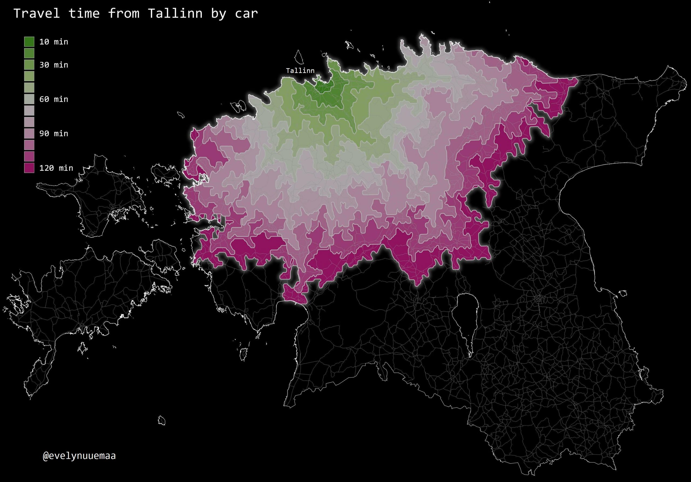

The 17th day - ZONES.The travel time can be represented as isochrones. [HERE](https://www.here.com/) provides global travel time data. QGIS has [Hqgis](https://github.com/riccardoklinger/Hqgis) plugin that enables to use isochrones with the HERE API. You need to use your own HERE-API key. I think that the travel time for Tallinn is more or less adequate.

[Link to original Twitter post](https://twitter.com/evelynuuemaa/status/1196042890381873153)
