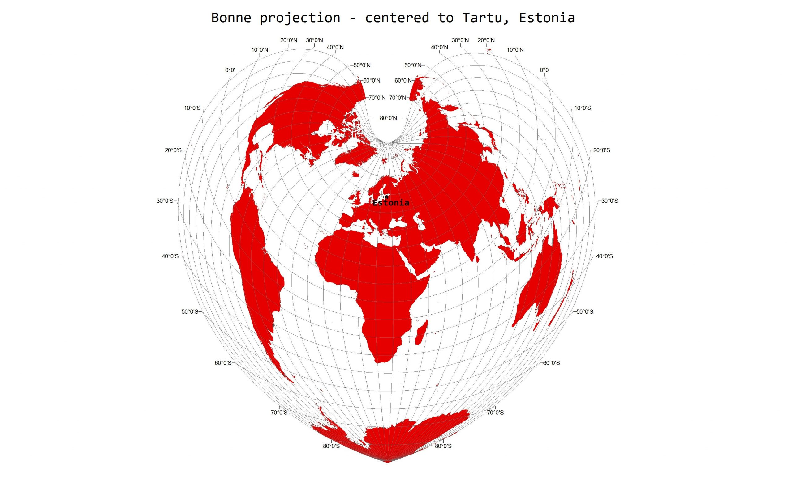

The 18th day - GLOBE. I used [Natural Earth](https://www.naturalearthdata.com/downloads/10m-cultural-vectors/10m-admin-0-countries/) country borders and projected it to Bonne projection ([EPSG 54024](https://epsg.io/54024)) that I centered to Tartu. Bonne projection is a pseudoconical equal-area map projection, meaning that it preserves shapes of areas along the central meridian and the standard parallel. Nowadays it's mostly used rather for art purposes to make visually nice and interesting maps.

[Link to original Twitter post](https://twitter.com/evelynuuemaa/status/1196353283696316416)
