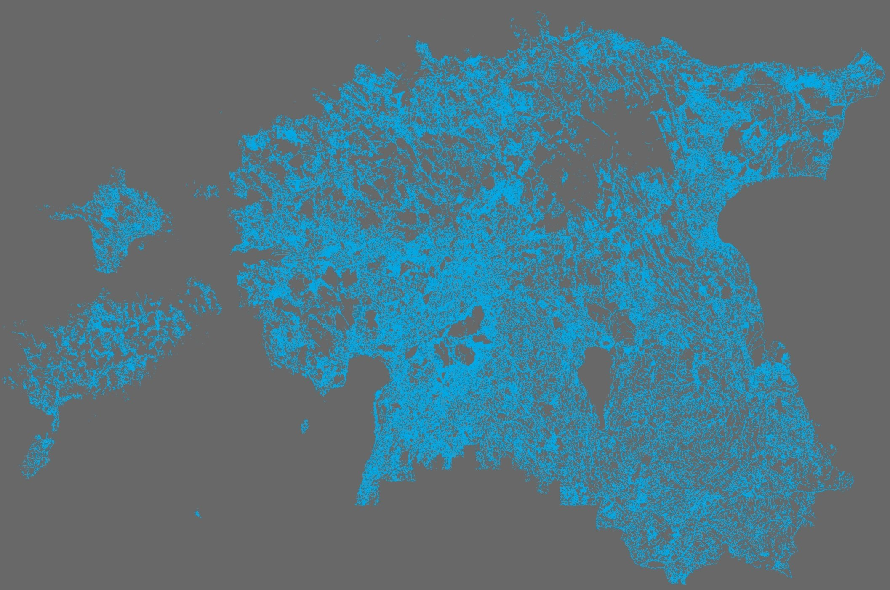

The second day challenge was LINES. As my research is related to hydrology then the obvious choice was to visualise Estonian stream network. Data is obtained from [Estonian Topographic Database (ETAK)](https://geoportaal.maaamet.ee/eng/Spatial-Data/Estonian-Topographic-Database-p305.html) which is open data and can be downloaded from Estonian Land Board. With all the small streams and drainage, Estonia's stream network is surpsisingly high density. The larger "no stream" areas are wetlands and Pandivere karst area.

[Link to original Twitter post](https://twitter.com/evelynuuemaa/status/1190868666054840321)
