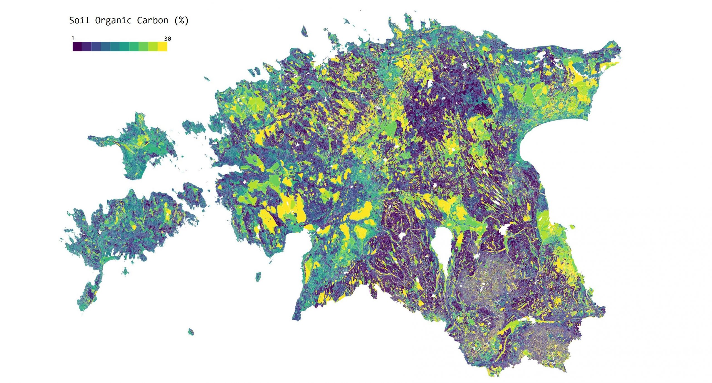

The 20th day - RURAL. Soil organic carbon as one of the very important ecosystem services in terms of agriculture. Modelled by our Landscape Geoinformatics team by using machine learning. The dataset is currently under review in [Earth System Science Data]https://essd.copernicus.org/preprints/essd-2019-192/).

[Link to original Twitter post](https://twitter.com/evelynuuemaa/status/1197166273597263872)
