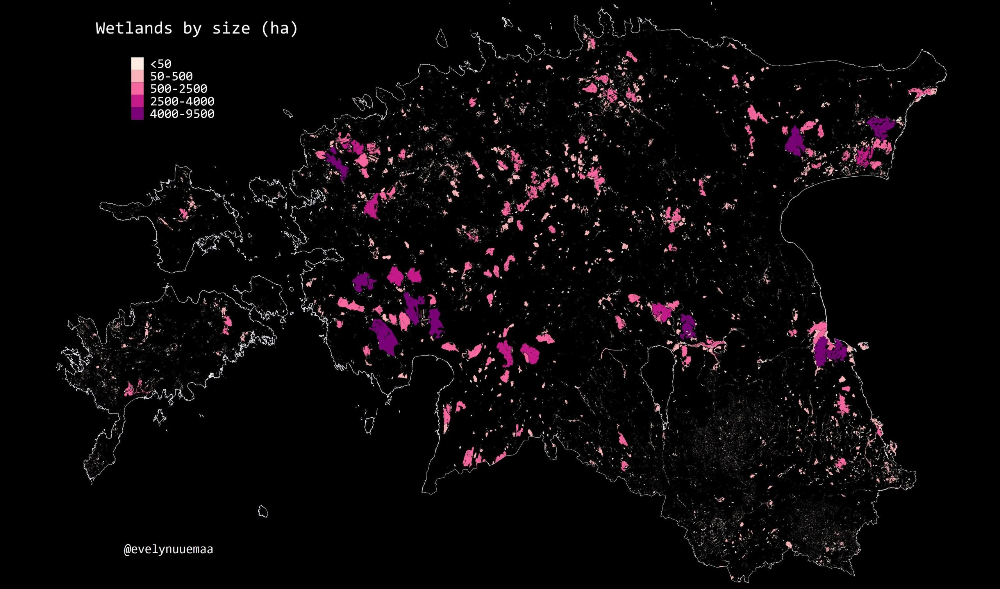

The 21st day - ENVIRONMENT. Wetlands are in most parts of the world lost environments.  Estonia has been blessed with many wetlands -  almost 40 000 and ranging from 0.002 ha to 9000 ha in size. I used land use data from [Estonian Topographich Database](https://geoportaal.maaamet.ee/eng/Spatial-Data/Estonian-Topographic-Database-p305.html)

[Link to original Twitter post](https://twitter.com/evelynuuemaa/status/1197554013430059008)
