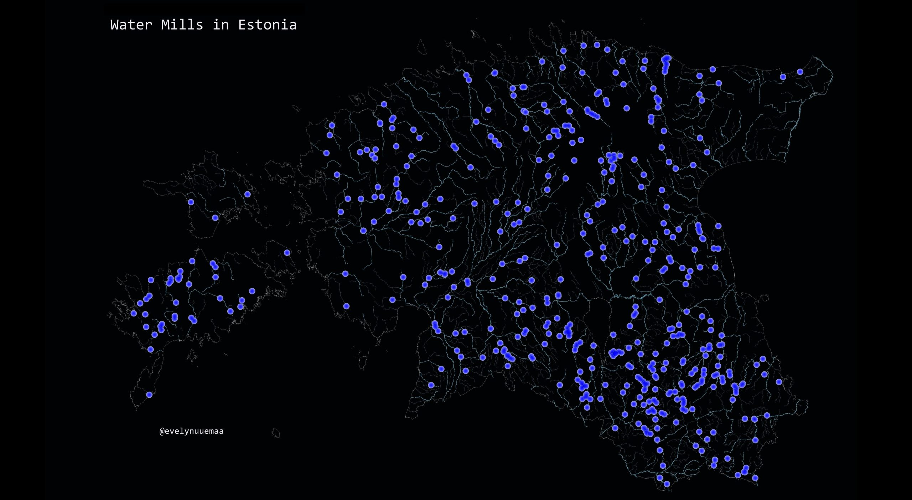

The 27th day - RESOURCES. Tribute to water mills – our forgotten resource. Estonia is full of small water mills that nowadays are mostly not working anymore. There are some rare exceptions like [Hellenurme Water Mill](https://veskimuuseum.ee/) which is still making flour with the power of water. I highly recommend to visit this mill if you already haven't done so :)

Data from [Keskkonnaregister](http://register.keskkonnainfo.ee/)

[Link to original Twitter post](https://twitter.com/evelynuuemaa/status/1199668164155650049)
