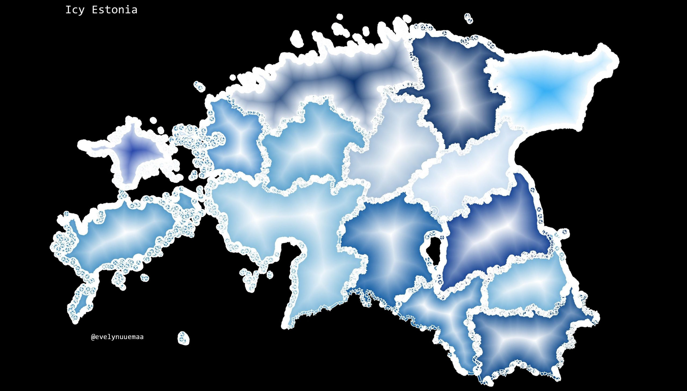

The 28th day - FUNNY. The last days have been extremely icy and slippery in Estonia. Therefore this map was inspired by the current weather conditions. I used Estonian admistrative units (counties) from [Estonian Land Board Administrative dataset](https://geoportaal.maaamet.ee/eng/Spatial-Data/Administrative-and-Settlement-Division-p312.html). To create snowy-icy effect, I styled the fill and outline on separate layers. For the fill I used color ramp from white to dark blue and symbol layer type 'Shapeburst fill'. For the outline I used symbol layer type as "Arrow" and making the arrow very short (kind of a lot of arrows piling on top of each other) I achieved icy-like outline.
The icy QGIS style can be also downloaded from [HERE](https://github.com/kevelyn1/qgis_styles/tree/master/icy_style)

[Link to original Twitter post](https://twitter.com/evelynuuemaa/status/1199959150756868096)
