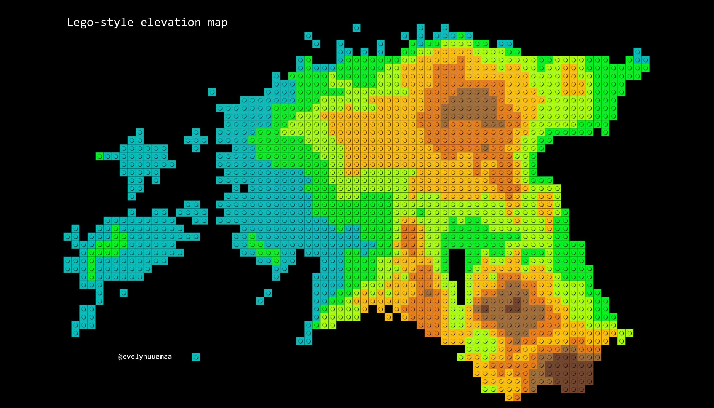

The 29th day - EXPERIMENTAL. From the moment I saw [Andriy Yaremenko's tutorial](https://medium.com/@andriyyaremenko/how-to-create-lego-map-style-in-qgis-a8ecf42d02ef) for making LEGO maps, I knew I want to try it out myself. Super simple and a lot of fun!

[Link to original Twitter post](https://twitter.com/evelynuuemaa/status/1200450285950394368)
