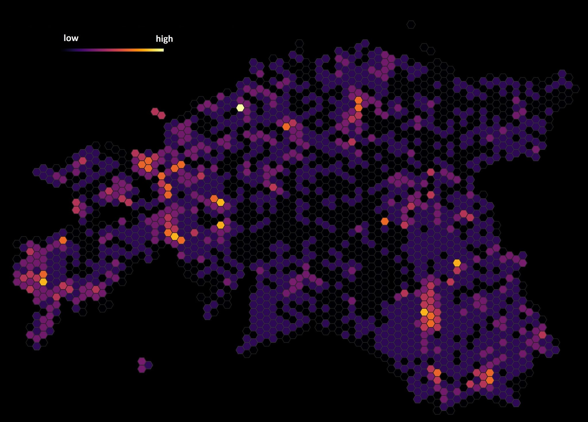

The fouth day challenge was HEXAGONS. Hexagons are a bit trendy geospatial stuff now. However, [in many ways they are quite practical for spatial analysis because](https://pro.arcgis.com/en/pro-app/tool-reference/spatial-statistics/h-whyhexagons.htm) and they are also visually pleasing. Here I used data on endangered species (protection category III) in Estonia available in [Keskkonnaregister](http://register.keskkonnainfo.ee/envreg/main#HTTPMEIfS5yz6tO2i4neiio8eLlfUdpe6o)
Workflow: I used QGIS 'Create Grid' tool to create 5km hexagons. As the endangered species were point data then I used 'Count points in polygon' to aggregate the point data to polygons and visualised by using Magma color ramp.

[Link to original Twitter post](https://twitter.com/evelynuuemaa/status/1191250104327507968)
