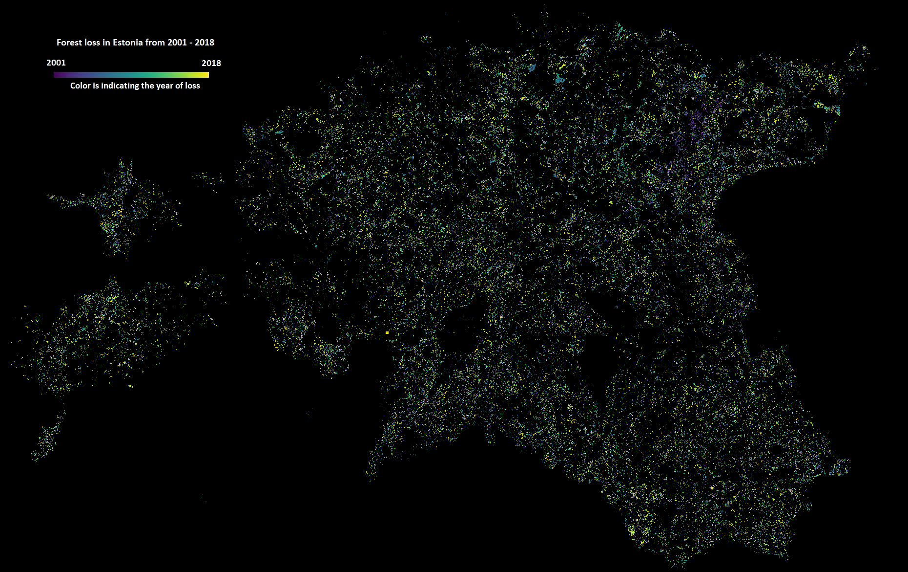

The fifth day challenge was RASTER. A lot debated forest management came to my mind when thinking of the suitable data to map. As I have been recently working with the [Global Forest Change](https://earthenginepartners.appspot.com/science-2013-global-forest) dataset then decided to map forest loss in Estonia. The forest loss in this dataset actually means any kind of disturbance incl. natural (wind, fire etc).  However, in most cases in Estonia, it is forest cut. I've validated it also against Estonian official statistics by [SMI](https://www.keskkonnaagentuur.ee/et/eesmargid-tegevused/mets/smi) and they are quite valid. 
The GFC dataset is super-simple. It just maps the year of the loss and I visualised it with using Viridis color ramp.

[Link to original Twitter post](https://twitter.com/evelynuuemaa/status/1191606499543584769)
