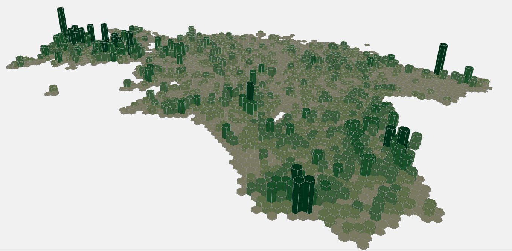

The eight day - GREEN. Time to try something new - 3D in QGIS. Not that green has any meaning fro cultural heritage objects but that was just another dataset that I wanted to visualise. THe dataset can be found from [Keskkonnaregister](http://register.keskkonnainfo.ee/). However, this dataset does not include objects that are officially protected by Muinsuskaitseamet. 
**Workflow:** The dataset is point dataset and the initial workflow was similar to [Hexagon map](https://kevelyn1.github.io/30DayMapChallenge2019/mapchallenge/day-4/). For 3D visualisation, I used Qgis2threejs plugin which makes 3D mapping in QGIS very easy. There is a good [tutorial](https://qgis2threejs.readthedocs.io/en/docs/Tutorial.html) to follow. For after-effects I used [three.js editor](https://threejs.org/editor/).

[Link to original Twitter post](https://twitter.com/evelynuuemaa/status/1193037771377643520)
