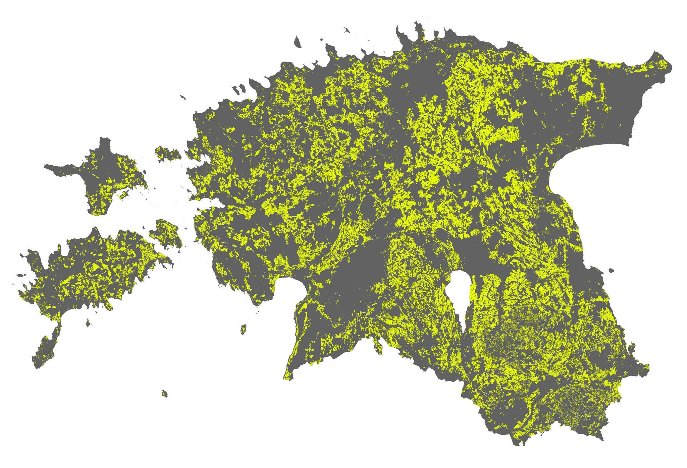

The ninth day - YELLOW. For a geographer who reads maps all the time, yellow probably associates with arable land as it is often colored red in maps. Therefore obvious choice to map for a yellow was arable land. The data is from [Estonian Topographic Database](https://geoportaal.maaamet.ee/eng/Spatial-Data/Estonian-Topographic-Database-p305.html). This is probably my most used data source during the challenge :)

[Link to original Twitter post](https://twitter.com/evelynuuemaa/status/1193099668080807937)
